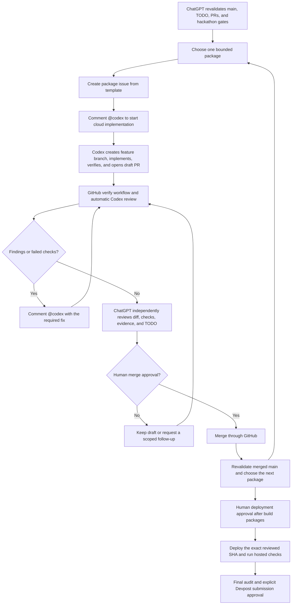

# PolicyLens hackathon orchestration workflow

This is the durable operating model for finishing PolicyLens. ChatGPT remains the product and release orchestrator; Codex cloud implements one bounded package at a time; GitHub carries the package context, code, checks, reviews, and fix loop.

`TODO.md` remains the only active implementation queue. This runbook describes how work moves through that queue; it is not a second checklist.

## Workflow



## One-time setup

1. In [Codex cloud](https://learn.chatgpt.com/docs/cloud), connect `icecold009/hacksocial-policylens` and create a [repository environment](https://learn.chatgpt.com/docs/environments/cloud-environment). Use `npm ci` as the setup command; keep provider credentials in the environment, never in the repository.
2. In Codex settings, enable [Code review](https://learn.chatgpt.com/docs/third-party/github) for this repository and turn on automatic reviews.
3. After the workflow has run once on a pull request, add a GitHub ruleset for `main` that requires a pull request, the `verify` status check, resolved review conversations, and blocks force pushes. Keep merge as a human-only gate.
4. Keep the native Codex GitHub integration as the default review/fix path. Do not add the API-key-backed Codex GitHub Action unless a later package needs a custom review that the native integration cannot provide.
5. Optionally start the Devpost-guided project state with `$start-hackathon`; use `$hackathon-map` whenever the submission journey needs to be re-oriented.

The repository supplies the remaining durable context through `AGENTS.md`, the package issue form, the pull request template, and the `verify` workflow.

## Package contract

ChatGPT selects the smallest coherent unchecked slice in `TODO.md` whose dependencies are satisfied. A package should normally fit one focused Codex task and one reviewable pull request.

Every package issue must define:

- Outcome: the user-visible or release result.
- Scope: exact behavior and likely files in bounds.
- Non-goals: tempting adjacent work that stays out.
- Acceptance: observable criteria that prove completion.
- Verification: commands plus any browser, preview, hosted, or manual checks.
- Evidence: current TODO entries, PRs, screenshots, errors, or decisions that constrain the work.
- Human gates: merge, deployment, credentials, external writes, and Devpost submission.

If Codex discovers that acceptance requires a material scope expansion, it stops and reports the decision instead of expanding the package.

## Exact handoff loop

### 1. ChatGPT creates the package

Use GitHub's **New issue → Codex implementation package** form. When the GitHub app is connected, ChatGPT can fill this form, so the issue body becomes the implementation specification and no prompt has to be copied between products.

### 2. Start Codex cloud

On the package issue, add one comment:

```text
@codex implement this package. Follow AGENTS.md. Start from current main on a new codex/pl-<issue-number>-<slug> branch, run every requested check, push the branch, and open a draft PR linked to this issue. Do not merge or deploy.
```

That single mention is the remaining deliberate task-start gate. If cloud publication is unavailable for the task, review its result and use Codex cloud's **Open pull request** action; do not recreate the implementation prompt.

### 3. Let GitHub perform the mechanical loop

Opening or updating the pull request runs `.github/workflows/verify.yml`. Automatic Codex review supplies a separate high-signal review pass using the repository's `AGENTS.md` review rules.

For a one-off review focus, comment:

```text
@codex review for evidence-boundary, privacy, and regression issues
```

For a validated finding, reply in the same pull request:

```text
@codex fix the P1 finding, add the missing regression test, run npm run verify, and update the existing branch. Do not broaden scope or merge.
```

For a stale branch, use:

```text
@codex sync this PR branch with current main without force-pushing, resolve only in-scope conflicts, rerun npm run verify, and report any semantic conflict instead of guessing.
```

Each push reruns checks and review. Keep the discussion, fixes, and evidence on the same issue and pull request.

### 4. Independent orchestration review

After checks and Codex review finish, ChatGPT re-reads the current GitHub state rather than relying on the original prompt. It verifies:

- the PR diff is limited to the package;
- acceptance criteria and relevant `TODO.md` evidence are complete;
- `verify` passed on the current head SHA;
- review findings are resolved or explicitly accepted;
- local, CI, preview, hosted, production, and user-reported evidence are labelled correctly;
- the next package still makes sense after the merged change.

### 5. Human merge and release gates

Only the user approves merge. After merge, ChatGPT revalidates `main` and selects the next package. Deployment waits until the intended build packages are merged, then deploys the exact reviewed SHA and records hosted evidence. Devpost submission remains a separate explicit-confirmation gate.

## What is automated and what remains manual

| Stage | Default handling | Why |
| --- | --- | --- |
| Package specification | ChatGPT + issue form | Durable, reviewable context without prompt copying |
| Codex task start | One `@codex` issue comment | Intentional spend and scope gate |
| Feature branch and implementation | Codex cloud | Isolated, reproducible environment |
| Draft PR | Codex cloud or its Open PR action | Avoids recreating branch/PR metadata |
| Tests and build | GitHub `verify` workflow | Deterministic and reruns on every push |
| Code review | Automatic Codex review | Repository-specific high-signal review rules |
| Fix loop | `@codex` PR comments | Same branch, context, and audit trail |
| Branch synchronization | `@codex` PR comment | No local checkout hopping or force push |
| Merge | User approval | Irreversible publication boundary |
| Deployment | User approval, then automated delivery | Cost, credentials, and production boundary |
| Devpost submission | Explicit user confirmation | External competition submission boundary |

## Recommended next package

The current code and local evidence are already on `main`. The next coherent package should triage and upgrade the Vite/esbuild development toolchain recorded in `TODO.md` Milestone 6; a clean install currently reports one high and one moderate advisory, and the available Vite fix is semver-major. Keep that upgrade isolated and rerun `npm audit` plus `npm run verify` before moving to the deployment preview and hosted smoke-test package from Milestone 7.

Peer testing, screenshots/video, final production promotion, and Devpost submission stay as later packages because they require different evidence and human participation.
